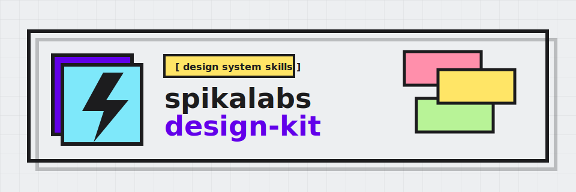

<p align="center">
  
</p>

# spikalabs-design-kit

spikalabs design kit for agent-assisted implementation and redesign of interfaces in the Neo-brutalist visual language.

The scope is intentionally narrow: it teaches agents to produce visible structure, hard black borders, offset shadows, Space Mono UI, spikalabs accent colors, tactile hover states, and high-contrast layouts instead of generic SaaS templates.

## Style source

Start here before changing the skills:

- [`docs/REFERENCE_WEBSITE_AUDIT.md`](docs/REFERENCE_WEBSITE_AUDIT.md)
- [`docs/spikalabs-design-kit-style-guide.md`](docs/spikalabs-design-kit-style-guide.md)
- [`docs/spikalabs-brand-symbol.md`](docs/spikalabs-brand-symbol.md)

Core extracted tokens:

| Role | Value |
| --- | --- |
| Primary purple | `#6200ea` |
| Symbol purple range | `#6A00FF` / `#6200EA` / `#5200D8` |
| Symbol black | `#050505` |
| Paper | `#edeff1` |
| Ink | `#1c1c1e` |
| Gray | `#3a3a3c` |
| Light gray | `#a0a8aa` |
| Yellow | `#ffe566` |
| Cyan | `#7ee8fa` |
| Pink | `#ff8fab` |
| Lime | `#b8f397` |
| Border | `2px solid #1c1c1e` |
| Shadow | `3px 3px 0 0 #1c1c1e` |
| Hover shadow | `5px 5px 0 0 #1c1c1e` |
| Large frame shadow | `6px 6px 0 0 #1c1c1e` |

## Brand assets

- `assets/brand/spikalabs-symbol.png` is the provided raster source reference for the spikalabs symbol.
- `assets/brand/spikalabs-symbol.svg` is the canonical vector spikalabs symbol mark for kit branding.
- `assets/brand/spikalabs-design-kit.svg` is the repository banner lockup using that symbol inside the Neo-brutal frame system.
- Use the symbol for brand moments in headers, hero visuals, brand-board covers, app icons, favicons, and internal documentation. Do not invent substitute spikalabs symbol marks unless a task explicitly asks for exploratory logo work.

## Using the kit

### Project-scoped usage (recommended)

Use project scope when the spikalabs design rules should apply only to the current repository.
The kit exposes the same canonical skills through both supported project locations:

- Codex: `.agents/skills/<skill-name>/SKILL.md`
- Claude Code: `.claude/skills/<skill-name>/SKILL.md`

Install without cloning this kit by running the npm executable from the target project:

```bash
npx -y @spikalabs/design-kit --target .
```

Alternatively, install directly from GitHub when you need an unpublished branch or commit:

```bash
npx -y github:spikalabscorp/spikalabs-design-kit --target .
```

Install one skill into the current project:

```bash
npx -y @spikalabs/design-kit \
  --target . \
  --skill spikalabs-design-kit-frontend
```

Ask an agent to install project-scoped skills by generating a copy-paste prompt:

```bash
npx -y @spikalabs/design-kit \
  agent-prompt \
  --skill spikalabs-design-kit-gpt
```

The repository also ships Codex and Claude Code plugin marketplace metadata for
teams that prefer plugin installation flows over checked-in skill folders. Use
the npx installer above when the desired output is literal project-scope
`.agents/skills` and `.claude/skills` folders committed to a target repo.

When you already have this kit cloned locally, the shell installer remains available:

```bash
./scripts/install-project-scope.sh --target /path/to/project
```

For active kit development, link a target project back to this checkout:

```bash
./scripts/install-project-scope.sh --target /path/to/project --link --force
```

See [`docs/PROJECT_SCOPE_SKILLS.md`](docs/PROJECT_SCOPE_SKILLS.md) for npx, agent-assisted, plugin marketplace, verification, and maintenance notes.

### Global install (optional)

Use global installation when these skills should be available to every project on the
machine without per-repo setup.

Install the package globally via npm:

```bash
npm install -g @spikalabs/design-kit
```

After global installation, the `spikalabs-design-kit` command is available system-wide.
Run it from any project root to install project-scoped skills:

```bash
spikalabs-design-kit --target .
```

For Codex and Claude Code global skill discovery, copy the skills into the
agent-specific global directories:

**Codex** — reads global skills from `~/.codex/skills/`:

```bash
spikalabs-design-kit --target ~/.codex --codex-only
```

**Claude Code** — reads global skills from `~/.claude/skills/`:

```bash
spikalabs-design-kit --target ~/.claude --claude-only
```

> **Note:** Global skills apply to every Codex or Claude Code session on the
> machine. Prefer project-scoped install for repository-specific work so the
> design rules travel with the repository and do not leak into unrelated sessions.

## Skills

| Folder | Install name | Purpose |
| --- | --- | --- |
| `spikalabs-design-kit-frontend` | `spikalabs-design-kit-frontend` | Image-first implementation skill for landing pages, marketing pages, portfolios, and editorial pages that generates a `$imagegen` UI reference before frontend code. |
| `spikalabs-design-kit-redesign` | `spikalabs-design-kit-redesign` | Audit-first transformation that generates a `$imagegen` target-state reference before migrating existing projects into the spikalabs-design-kit Neo-brutal system. |
| `spikalabs-design-kit-gpt` | `spikalabs-design-kit-gpt` | Stricter GPT/Codex-oriented variant with mandatory design plan, `$imagegen` reference before code, and complete output rules. |
| `spikalabs-design-kit-image-to-code` | `spikalabs-design-kit-image-to-code` | Image-first workflow for generating or analyzing references, extracting them, then implementing matching code. |
| `spikalabs-design-kit-imagegen-web` | `spikalabs-design-kit-imagegen-web` | Image-generation-only web reference skill for standalone comps and pre-implementation UI mockups. |
| `spikalabs-design-kit-imagegen-mobile` | `spikalabs-design-kit-imagegen-mobile` | Image-generation-only mobile screen and flow skill for standalone comps and pre-implementation UI mockups. |
| `spikalabs-design-kit-brandkit` | `spikalabs-design-kit-brandkit` | Image-generation-only symbol-led brand board skill using the provided spikalabs symbol mark and hard-border style. |
| `spikalabs-design-kit-stitch` | `spikalabs-design-kit-stitch` | Google Stitch-compatible semantic design-system generator. |
| `spikalabs-design-kit-output-enforcement` | `spikalabs-design-kit-output-enforcement` | Utility skill that prevents placeholder or truncated code output. |

## Design rules in one screen

- Build visible structure: bordered sections, grid backgrounds, framed media, bracketed nav labels.
- Use Space Mono for UI voice: labels, buttons, chips, metadata, and high-impact headings.
- Use hard shadows only: no blur radius, no glass panels, no soft gray cards.
- Keep accent color purposeful: purple for hierarchy, yellow/cyan/pink/lime for surfaces and categories.
- Use the spikalabs symbol as the brand anchor; do not invent replacement marks.
- Make interactions tactile: hover moves up-left, active moves down-right and removes shadow.
- Preserve accessibility: visible focus rings, high contrast, reduced-motion fallbacks.

## Repository structure

```text
.
├── .agents/
│   └── skills/              # Codex project-scope adapters
├── .claude/
│   └── skills/              # Claude Code project-scope adapters
├── docs/
│   ├── REFERENCE_WEBSITE_AUDIT.md
│   ├── spikalabs-design-kit-style-guide.md
│   ├── spikalabs-brand-symbol.md
│   └── PROJECT_SCOPE_SKILLS.md
├── assets/
│   └── brand/
│       ├── spikalabs-symbol.png
│       ├── spikalabs-symbol.svg
│       └── spikalabs-design-kit.svg
├── skills/
│   ├── spikalabs-design-kit-frontend/
│   ├── spikalabs-design-kit-redesign/
│   ├── spikalabs-design-kit-gpt/
│   ├── spikalabs-design-kit-image-to-code/
│   ├── spikalabs-design-kit-imagegen-web/
│   ├── spikalabs-design-kit-imagegen-mobile/
│   ├── spikalabs-design-kit-brandkit/
│   ├── spikalabs-design-kit-stitch/
│   └── spikalabs-design-kit-output-enforcement/
├── bin/
│   └── spikalabs-design-kit.mjs
├── scripts/
│   └── install-project-scope.sh
├── package.json
├── skill.sh
└── CHANGELOG.md
```

## License and attribution

MIT. See [`LICENSE`](LICENSE) and [`NOTICE.md`](NOTICE.md).

`spikalabs-design-kit` is a fork of the original `taste-skill` project. The
upstream copyright notice is retained for the original work, and fork-specific
modifications created by spikalabs are copyrighted by `spikalabs Co, Ltd.`.
